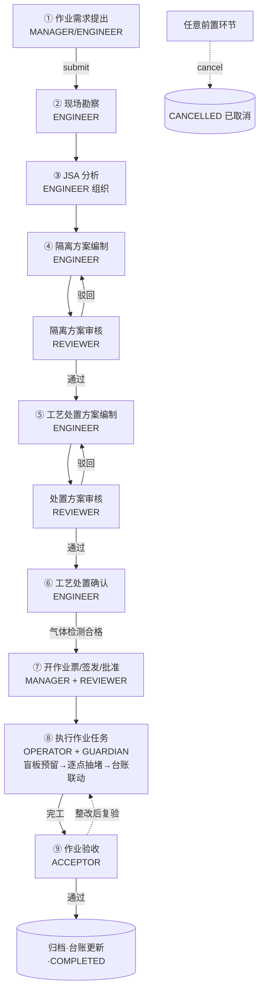
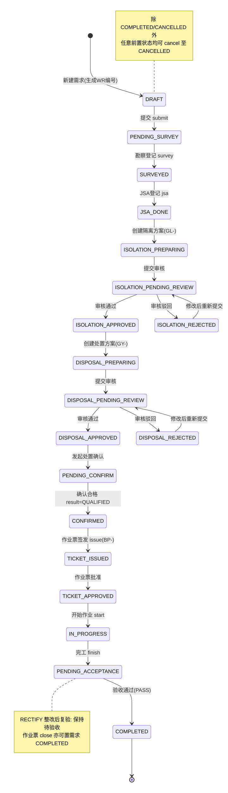

# 盲板管理系统 功能需求说明书

| 文档编号 | BP-SRS-001 |
| --- | --- |
| 文档名称 | 石化厂盲板管理系统 功能需求说明书 |
| 版本 | V1.0 |
| 编写 | 设计文档代理（Task 2-a） |
| 适用范围 | 盲板抽堵作业全流程管理系统（WEB 端 + 移动端） |
| 关联文档 | 02-概要设计.md、03-详细设计.md、worklog.md |

---

## 1 引言

### 1.1 编写目的

本文档面向盲板管理系统的开发、测试、实施与使用人员，完整描述系统的业务背景、用户角色、业务流程、WEB 端与移动端功能需求、非功能需求以及核心单据（作业需求）的状态机。本文档是后续概要设计、详细设计、编码实现与测试验收的直接依据。

### 1.2 适用读者

- 项目管理人员：了解业务范围与功能边界；
- 开发人员：依据功能编号与状态机实现各模块；
- 测试人员：依据验收标准编写测试用例；
- 企业 HSE / 生产管理人员：确认系统与管理制度的一致性。

### 1.3 参考资料

1. GB 30871-2022《危险化学品企业特殊作业安全规范》（盲板抽堵作业属于八大特殊作业之一）；
2. GBZ 2.1《工作场所有害因素职业接触限值 化学有害因素》（有毒气体接触限值）；
3. 企业《盲板管理制度》《工艺处置及隔离管理规范》等 HSE 管理制度；
4. 本项目 worklog.md（数据模型、API 契约、状态机约定）；
5. prisma/schema.prisma（数据模型权威定义）。

### 1.4 术语与缩略语

| 术语 | 说明 |
| --- | --- |
| 盲板 | 插入管道法兰间用于可靠隔离介质流通的板状隔离件，常见形式：八字盲板、插板、垫环、盲法兰 |
| 抽堵 | "堵"为加装盲板（隔离），"抽"为拆除盲板（恢复） |
| 特殊作业 | GB 30871 定义的动火、受限空间、盲板抽堵、高处、吊装、临时用电、动土、断路等危险性作业 |
| JSA | Job Safety Analysis，作业安全分析，逐步骤识别危害并制定控制措施 |
| 隔离方案 | 明确隔离位置、盲板规格/类型、隔离点的技术方案 |
| 工艺处置方案 | 作业前对系统进行泄压、排净、置换、吹扫、蒸煮、气体检测等处置的方案 |
| LEL | 爆炸下限（Lower Explosive Limit），可燃气体浓度以其百分比表示 |
| 一板一码 | 每一块盲板实体具有唯一编号（二维码），全生命周期台账管理 |
| 作业票 | 盲板抽堵安全作业票，作业执行阶段的许可凭证 |

---

## 2 项目背景与目标

### 2.1 业务背景

石化装置生产介质多为易燃、易爆、有毒、高温、高压物料。装置检修、技改、清罐、切换流程等活动中，需要对管线/设备进行**可靠隔离**，仅靠关闭阀门无法保证绝对隔离（阀门可能内漏），行业通行做法是在法兰处**加装（堵）或拆除（抽）盲板**实现物理隔离。

盲板抽堵作业属于 GB 30871《危险化学品企业特殊作业安全规范》规定的特殊作业，具有以下典型风险：

1. **残压残液伤人**：拆卸法兰螺栓瞬间，管内残余带压介质（蒸汽、酸水、液化气等）喷溅伤人；
2. **可燃/有毒气体暴露**：作业过程介质外溢，存在火灾爆炸与中毒风险（如 H₂S）；
3. **高处与受限空间交叉**：盲板点常位于管廊、框架高处，或临近受限空间入口；
4. **盲板管理失控**：加装了多少块、装在哪里、何时拆除，若无台账与闭环管理，极易出现"忘抽盲板"导致开不可靠隔离或憋压事故——历次行业内重大事故中"盲板管理失效"是高频原因。

传统管理模式依赖纸质作业票、Excel 台账与电话沟通，存在流程不闭环、审核留痕缺失、盲板去向不清、统计困难等突出问题。

### 2.2 现状问题

| 序号 | 现状问题 | 系统应对 |
| --- | --- | --- |
| 1 | 作业需求→勘察→JSA→方案→作业票靠纸质流转，周期长、状态不清 | 状态机驱动全流程线上流转，实时可视 |
| 2 | 隔离方案、处置方案审核无留痕，责任不可追溯 | 审核提交/通过/驳回全量写审批记录 |
| 3 | 盲板台账与实际不符，"账实不符" | 一板一码 + 预留/安装/归还/报废联动 + 变动流水 |
| 4 | 工艺处置（泄压/置换/气体检测）凭经验、无数据 | 处置步骤 + 气体检测数据结构化登记 |
| 5 | 现场执行依赖口头传达，隔离点漏执行 | 隔离点逐项执行确认（PC 端 + 移动端扫码） |
| 6 | 管理层无法掌握作业分布与库存预警 | 统计看板（状态分布/装置排名/趋势/低库存） |

### 2.3 建设目标

1. **流程闭环**：覆盖"作业需求→现场勘察→JSA 分析→隔离方案编制及审核→工艺处置方案编制及审核→工艺处置确认→开作业票→执行作业任务→作业验收"九大环节，状态全程可追踪；
2. **合规留痕**：符合 GB 30871 特殊作业管理要求（作业票、气体检测、监护人、JSA），审核/审批全程留痕可查；
3. **账实一致**：盲板"一板一码"台账，预留→安装→归还→报废状态联动，变动记录完整；
4. **移动赋能**：作业人员通过移动端接单、扫码识别盲板、现场执行反馈，监护人/验收人移动端协同；
5. **数据辅助决策**：提供作业分布、趋势、库存预警等统计分析。

### 2.4 设计依据（合规要点映射）

| GB 30871 / HSE 管理要求 | 系统功能落点 |
| --- | --- |
| 作业前进行作业安全分析（JSA） | JSA 分析模块（步骤-危害-措施结构化登记） |
| 盲板统一编号、专人管理、盲板位置图 | 盲板台账（一板一码 MB-规格-序号）、隔离方案中的隔离点清单即"盲板位置图"的数字化 |
| 办理盲板抽堵安全作业票 | 作业票模块（BP- 编号，签发→批准→执行→完工→关闭） |
| 作业前完成泄压、排净、置换、吹扫等工艺处置 | 工艺处置方案（处置步骤库）+ 处置确认 |
| 作业环境可燃/有毒/氧含量气体检测合格 | 工艺处置确认单记录 LEL、氧含量、有毒气体检测值及合格结论 |
| 作业设专人监护，监护人不得擅离 | 作业票必填监护人字段；安全措施中明确监护要求 |
| 作业完毕恢复现场并验收 | 作业验收（无泄漏/现场恢复/台账更新三项确认） |
| 审核审批留痕 | ApprovalRecord 审批记录（提交/同意/驳回） |

> 说明：系统内气体检测合格线（如可燃气体 LEL＜0.5%、氧含量 19.5%~21%、H₂S＜10ppm）为行业常用示例默认值，实际执行标准以企业 HSE 制度与现行法规为准，界面上按文本登记检测值，不做硬校验拦截、只做提示。

### 2.5 建设范围

- **WEB 端**（管理端）：系统管理、基础数据、作业需求（含勘察/JSA）、方案编制（隔离/处置/确认）、作业任务管理（作业票/任务/执行/验收）、台账管理（盲板/库存/变动）、统计分析；
- **移动端**（uniapp + uview2）：我的任务、扫码识别盲板、任务执行反馈、验收申请、消息通知；
- **不在本期范围**：与 DCS/LIMS 系统的实时集成、电子签章、盲板 CAD 图纸管理、备品备件采购流程。

---

## 3 用户角色定义

### 3.1 角色清单

系统采用 **RBAC（基于角色的访问控制）**，共 7 个角色，角色代码与 `User.role` 字段取值严格一致：

| 角色代码 | 角色名称 | 典型岗位 | 角色定位 |
| --- | --- | --- | --- |
| ADMIN | 系统管理员 | 信息中心系统管理员 | 系统运维与基础数据管理者，负责用户、装置、字典等基础数据维护 |
| MANAGER | 分管领导 | 生产技术部/装置主任 | 作业需求提出人（申请人）、作业票签发人，掌握全局作业动态 |
| ENGINEER | 工艺工程师 | 车间工艺组工程师 | 技术主线承担者：现场勘察、组织 JSA、编制隔离方案与工艺处置方案、工艺处置确认 |
| REVIEWER | 方案审核人 | 安全环保部/技术负责人 | 审核把关者：隔离方案、工艺处置方案、作业票的审核批准/驳回 |
| OPERATOR | 作业人员 | 检修班长/检修工 | 现场执行者：领用预留盲板、按隔离点执行抽堵、执行反馈 |
| GUARDIAN | 监护人 | 安全员 | 现场监护：作业前安全措施确认、作业过程旁站监护 |
| ACCEPTOR | 验收人 | 生产技术部/车间管理者 | 作业验收：无泄漏、现场恢复、台账更新三项确认 |

> 说明：一个用户一个角色（`User.role` 单值）。实际企业中一人可承担多角色时，建议建立多个账号或后续扩展多角色。

### 3.2 角色职责矩阵（RACI）

R=负责执行，A=审批负责，C=参与/被咨询，I=知会

| 业务环节 | ADMIN | MANAGER | ENGINEER | REVIEWER | OPERATOR | GUARDIAN | ACCEPTOR |
| --- | --- | --- | --- | --- | --- | --- | --- |
| 作业需求提出 | I | R/A | C | I | I | I | I |
| 现场勘察 | I | I | R | I | C | C | I |
| JSA 分析 | I | I | R/A | C | C | C | I |
| 隔离方案编制 | I | I | R | I | I | I | I |
| 隔离方案审核 | I | I | C | R/A | I | I | I |
| 工艺处置方案编制 | I | I | R | I | I | I | I |
| 工艺处置方案审核 | I | I | C | R/A | I | I | I |
| 工艺处置确认 | I | C | R/A | I | C | C | I |
| 开作业票（生成/签发） | I | R/A | C | I | I | I | I |
| 作业票批准 | I | C | I | R/A | I | I | I |
| 盲板预留领用 | I | I | C | I | R | I | I |
| 执行抽堵作业 | I | I | I | I | R | C | I |
| 作业完工/关闭 | I | C | I | I | R | C | I |
| 作业验收 | I | C | C | I | C | C | R/A |
| 基础数据/用户管理 | R/A | I | I | I | I | I | I |
| 统计分析 | R | R | I | I | I | I | I |

### 3.3 角色与数据可见范围

| 角色 | 可见数据范围 |
| --- | --- |
| ADMIN | 全部数据；可维护用户/装置/字典 |
| MANAGER | 全部作业单据与统计（以分管装置为原则，本系统不强制行级过滤，界面按角色导航） |
| ENGINEER | 所辖装置的作业需求及其派生单据（勘察/JSA/方案/确认） |
| REVIEWER | 待审核方案/作业票清单及其来源需求 |
| OPERATOR | 分派给自己的作业任务、关联作业票与隔离点明细、盲板台账 |
| GUARDIAN | 作业票中本人为监护人的作业信息 |
| ACCEPTOR | 待验收作业清单 |

> 实现约定：沙箱版本以"界面按角色显隐导航与操作按钮"实现权限控制（前端 RBAC）；生产版本在服务端接口层同样做角色校验（见 02-概要设计 权限模型）。

---

## 4 业务流程总述

### 4.1 流程总图

流程主线共 9 个环节，任意未达终态（COMPLETED）的前置状态均可**取消**（CANCELLED）。以下逐环节给出 输入/处理/输出/参与角色/状态流转。

---

### 4.2 环节①：作业需求提出

| 项 | 说明 |
| --- | --- |
| 输入 | 装置检修/技改计划、临时作业需要：作业标题、作业类型（装/抽/抽装）、目标装置、具体位置（管线/设备位号）、管线名称、介质、压力、温度、作业原因、紧急程度、计划起止时间、申请人 |
| 处理 | 申请人填写《作业需求单》（系统生成唯一编号 WR-YYYYMM-NNN）；保存为草稿可反复编辑；确认无误后**提交**进入勘察环节。服务端生成编号、登记创建时间 |
| 输出 | WorkRequest 单据（DRAFT→PENDING_SURVEY），进入"待现场勘察"待办池 |
| 参与角色 | MANAGER/ENGINEER（提出、编辑、提交）；ADMIN（数据维护支持） |
| 状态流转 | DRAFT（草稿）→ 提交 submit → PENDING_SURVEY（待现场勘察） |
| 异常分支 | 草稿可删除性不做物理删除，未提交前可取消；提交后发现错漏可在勘察前退回（由管理员/申请人协商，线上以"取消+重建"兜底） |

### 4.3 环节②：现场勘察

| 项 | 说明 |
| --- | --- |
| 输入 | 作业需求单；现场实际条件：勘察人、勘察日期、现场条件描述（平台/照明/交叉作业/空间）、管线参数核实（介质/压力/温度与需求是否一致）、现场风险点（高处作业、残留介质、相邻高温管线等）、是否具备作业条件、勘察意见 |
| 处理 | 工艺工程师赴现场核实需求信息与实际工况一致性，登记勘察记录（每个需求一条，可 upsert 覆盖更新）；勘察结论 isSafe=false 时给出不具备条件的说明与整改建议 |
| 输出 | SiteSurvey 勘察记录；需求状态推进至"已勘察待 JSA" |
| 参与角色 | ENGINEER（勘察登记）；MANAGER（知会） |
| 状态流转 | PENDING_SURVEY → survey 登记成功 → SURVEYED（已勘察待JSA） |
| 异常分支 | isSafe=false：记录在案，需求保持可取消或整改后重新勘察（再次调用勘察接口覆盖更新） |

### 4.4 环节③：JSA 分析

| 项 | 说明 |
| --- | --- |
| 输入 | 勘察结论与现场风险点；JSA 信息：分析组长、参与人员（作业人员/监护人等）、分析日期、综合风险等级（LOW/MEDIUM/HIGH）、作业步骤清单（每步：作业步骤描述/危害因素/控制措施）、剩余风险与应急措施 |
| 处理 | 工艺工程师组织作业相关方开展 JSA；系统按"步骤-危害-措施"三列结构化登记（支持多条步骤、整体替换更新）；JSA 结论作为方案编制与作业票安全措施的直接输入 |
| 输出 | JsaAnalysis + JsaStep[]（1:N）；需求状态推进至"JSA 完成待方案" |
| 参与角色 | ENGINEER（组长/登记）；OPERATOR、GUARDIAN（参与分析） |
| 状态流转 | SURVEYED → jsa 登记成功 → JSA_DONE |
| 典型 JSA 步骤示例 | 1) 办票并确认处置完成 2) 搭设平台系挂安全带 3) 松对角螺栓泄压铺接油盘 4) 加装盲板对称紧固 5) 试压查漏并登记台账 |

### 4.5 环节④：隔离方案制定及审核

| 项 | 说明 |
| --- | --- |
| 输入 | JSA 结论；隔离技术信息：逐个隔离点的 序号、隔离位置（具体法兰/阀门）、管内介质、压力、温度、盲板规格、盲板类型、动作（ADD 加装 / REMOVE 拆除） |
| 处理 | 工艺工程师编制《隔离方案》（生成 GL- 编号）并录入隔离点明细；可为每个需加装/拆除的点**预留绑定一块具体盲板实体**（一板一码，BlindPlate 状态 IN_STOCK→RESERVED 并写变动记录）；编制完成后**提交审核**（写 ApprovalRecord-SUBMIT）；审核人审批：通过→方案 APPROVED；驳回→方案 REJECTED 并给出意见 |
| 输出 | IsolationScheme + IsolationPoint[]（GL- 编号）；审核记录；需求状态联动推进 |
| 参与角色 | ENGINEER（编制、提交）；REVIEWER（审核）；OPERATOR（可提前参与盲板预留） |
| 状态流转 | JSA_DONE → 创建隔离方案 → ISOLATION_PREPARING → 提交 → ISOLATION_PENDING_REVIEW → 通过 → ISOLATION_APPROVED；驳回 → ISOLATION_REJECTED（修改后可重新提交回到 ISOLATION_PENDING_REVIEW） |
| 专业要点 | 盲板选型必须与管线压力等级/温度/介质匹配（规格、材质、厚度、PN 等级）；氢气、液化气等高危介质隔离点建议双人复核；隔离点即"盲板位置图"的明细行 |

### 4.6 环节⑤：工艺处置方案制定及审核

| 项 | 说明 |
| --- | --- |
| 输入 | 隔离方案（ Approved ）；处置技术信息：逐条处置步骤的 处置方式（VENT 泄压降压 / DRAIN 排净 / REPLACE 置换 / PURGE 吹扫 / STEAM 蒸煮 / GAS_TEST 气体检测 / ISOLATE 切断加盲板 / OTHER 其他）、处置内容、合格标准 |
| 处理 | 工艺工程师编制《工艺处置方案》（生成 GY- 编号）与处置步骤；提交审核（写 ApprovalRecord）；审核通过/驳回与隔离方案同构。方案审批通过后即可按步骤现场执行处置（步骤完成可勾选 completed） |
| 输出 | DisposalScheme + DisposalStep[]（GY- 编号）；审核记录 |
| 参与角色 | ENGINEER（编制/提交/执行勾选）；REVIEWER（审核） |
| 状态流转 | ISOLATION_APPROVED → 创建处置方案 → DISPOSAL_PREPARING → 提交 → DISPOSAL_PENDING_REVIEW → 通过 → DISPOSAL_APPROVED；驳回 → DISPOSAL_REJECTED（可修改后重新提交） |
| 专业要点 | 高温管线须蒸煮/自然冷却至允许温度；含硫化氢介质吹扫后必须有毒气体检测；置换（氮气置换氢气/烃类）须检测置换后氧/氢含量；合格标准逐条量化（如"压力≤0.05MPa""LEL<0.5%"） |

### 4.7 环节⑥：工艺处置确认

| 项 | 说明 |
| --- | --- |
| 输入 | 处置方案及步骤完成情况；现场检测数据：确认人、确认时间、处置步骤是否全部完成、可燃气体检测结果（LEL%）、氧含量（%）、有毒气体浓度（如 H₂S ppm）、分析是否合格、备注 |
| 处理 | 工艺工程师在现场按处置方案逐项核实后登记《处置确认单》；**只有 result=QUALIFIED（合格）**才视为确认通过；不合格则保持待确认，整改后重新登记确认 |
| 输出 | DisposalConfirmation 确认单；需求状态进入"待开票" |
| 参与角色 | ENGINEER（确认登记）；MANAGER（知会） |
| 状态流转 | DISPOSAL_APPROVED → 发起确认 → PENDING_CONFIRM →（result=QUALIFIED）→ CONFIRMED（处置已确认待开票）；result=UNQUALIFIED 保持 PENDING_CONFIRM 可重新确认 |
| 专业要点 | 检测数据须登记实测值（如"LEL 0.2%""O₂ 20.8%""H₂S 2ppm"）；分析合格是开作业票的前置条件 |

### 4.8 环节⑦：开作业票

| 项 | 说明 |
| --- | --- |
| 输入 | CONFIRMED 状态的作业需求；作业票信息：计划起止时间、监护人、作业人员（多名）、签发人、安全措施（多条文本，如佩戴防化手套/警戒区/灭火器/气体检测合格/专人监护） |
| 处理 | 从需求一键生成《盲板抽堵安全作业票》（服务端校验需求状态必须为 CONFIRMED；生成 BP- 编号；同时生成对应作业任务 TSK- 编号）；签发（issue）→ 进入待批准；审核人批准（approve）→ 允许作业；驳回 → 作业票作废，需求回到待开票，修改后重新生成 |
| 输出 | WorkTicket（BP-）+ WorkTask（TSK-）；审批记录（TICKET 类型） |
| 参与角色 | MANAGER（生成/签发）；REVIEWER（批准/驳回） |
| 状态流转 | 需求：CONFIRMED → 签发 issue → TICKET_ISSUED（作业票待批准）→ 批准 → TICKET_APPROVED；作业票：DRAFT → PENDING_REVIEW → APPROVED（驳回→VOID 作废） |
| 专业要点 | 一张作业票对应一个作业需求；现场按 GB 30871"一处一点逐一签认"原则通过隔离点明细逐项执行确认实现；作业票有效期（计划起止时间）应覆盖作业窗口 |

### 4.9 环节⑧：执行作业任务

| 项 | 说明 |
| --- | --- |
| 输入 | 已批准作业票；作业任务（负责人=班长）；隔离点明细（含已预留的盲板）；现场执行反馈 |
| 处理 | ① 开始作业（start）：作业票→作业中，需求→IN_PROGRESS，任务置 IN_PROGRESS 并记录 actualStart；② 作业人员为各隔离点**预留领用盲板**（reserve：绑定具体盲板，台账 RESERVED）并逐点执行（execute：勾选完成，登记操作人/时间，同时联动盲板台账——加装点盲板 RESERVED→INSTALLED 位置更新为装置现场；拆除点盲板 INSTALLED→IN_STOCK 归还库位，全部写入变动流水）；③ 全部隔离点完成后完工（finish）：作业票→已完工，任务→DONE，需求→待验收 |
| 输出 | 隔离点执行结果（done/operator/doneAt）；盲板台账与库存联动更新；ChangeRecord 变动流水 |
| 参与角色 | OPERATOR（执行反馈）；GUARDIAN（现场监护）；MANAGER/ENGINEER（跟踪） |
| 状态流转 | 需求：TICKET_APPROVED → start → IN_PROGRESS → finish → PENDING_ACCEPTANCE；任务：PENDING → IN_PROGRESS → DONE；作业票：APPROVED → IN_PROGRESS → FINISHED |
| 专业要点 | 执行前监护人确认安全措施落实；执行中先泄压确认后拆螺栓；盲板安装须核对规格方向并对称紧固；执行后试压/查漏并挂牌标识；移动端扫码识别盲板确保"码-板-点"一致 |

### 4.10 环节⑨：作业验收

| 项 | 说明 |
| --- | --- |
| 输入 | 验收信息：验收人、验收时间、无泄漏确认（leakCheck）、现场恢复确认（restoreCheck：标识/垫片/螺栓紧固）、台账更新确认（ledgerCheck：盲板变动已登记）、验收结论（PASS 通过 / RECTIFY 整改后复验）、发现问题、备注 |
| 处理 | 验收人对作业结果三查：查泄漏、查现场恢复、查台账；结论 PASS → 需求 COMPLETED（作业票可执行关闭 close 归档）；结论 RECTIFY → 保持待验收并记录问题，整改后重新提交验收 |
| 输出 | Acceptance 验收单；需求终态 COMPLETED |
| 参与角色 | ACCEPTOR（验收）；OPERATOR（整改）；MANAGER（知会） |
| 状态流转 | PENDING_ACCEPTANCE → 验收通过 → COMPLETED；作业票 close → CLOSED（需求同步 COMPLETED） |
| 专业要点 | 拆除的盲板须确认已归还入库并同步台账；加装盲板须在盲板管理台账/位置图上登记挂牌，防止"忘抽盲板" |

---

## 5 WEB 端功能需求

WEB 端为单页应用（SPA），侧边栏模块导航。功能编号规则：`WEB-<模块码>-<两位序号>`，模块码：SM 系统管理 / BD 基础数据 / XJ 作业需求 / FA 方案编制 / ZY 作业任务管理 / TZ 台账管理 / TJ 统计分析。

### 5.1 系统管理（SM）

#### WEB-SM-01 登录认证

| 项 | 内容 |
| --- | --- |
| 功能描述 | 输入用户名/密码登录，验证通过后进入主界面；当前登录用户信息持久化（localStorage `bp_current_user`），刷新不丢失；退出登录清除本地态回到登录页。默认演示口令 123456 |
| 操作角色 | 全部角色 |
| 关联接口 | POST /api/auth/login |
| 验收标准 | 1) 用户名不存在或密码错误时提示"用户名或密码错误"；2) 账号被停用（active=false）时拒绝登录；3) 登录成功后侧边栏按角色渲染模块菜单；4) 刷新页面保持登录态，可一键退出 |

#### WEB-SM-02 用户管理

| 项 | 内容 |
| --- | --- |
| 功能描述 | 用户列表（关键字搜索）；新增用户（用户名唯一、姓名、角色、部门、手机号）；编辑用户；启用/停用；重置密码（重置为 123456）；删除用户 |
| 操作角色 | ADMIN |
| 关联接口 | GET/POST /api/users、PUT/DELETE /api/users/[id] |
| 验收标准 | 1) 用户名重复时保存失败并提示；2) 角色下拉包含 7 个角色且中文显示正确；3) 停用用户不可登录；4) 列表支持按用户名/姓名/部门搜索 |

#### WEB-SM-03 审批留痕查询

| 项 | 内容 |
| --- | --- |
| 功能描述 | 在作业需求详情中以时间线形式展示该单据链路全部审批记录（隔离方案/处置方案/作业票的提交、同意、驳回，含操作人/意见/时间） |
| 操作角色 | 全部角色（详情可见者） |
| 关联接口 | GET /api/work-requests/[id]（返回 approvals） |
| 验收标准 | 1) 方案每次提交/审核均有留痕；2) 驳回意见在时间线可见；3) 按时间倒序展示 |

### 5.2 基础数据管理（BD）

#### WEB-BD-01 装置管理

| 项 | 内容 |
| --- | --- |
| 功能描述 | 装置（车间）列表；新增/编辑装置（编码唯一、名称、负责人、电话、备注）；启用/停用；删除装置（被作业需求引用时应阻止或提示） |
| 操作角色 | ADMIN |
| 关联接口 | GET/POST /api/units、PUT/DELETE /api/units/[id] |
| 验收标准 | 1) 装置编码重复时保存失败；2) 停用装置在新建作业需求的装置下拉中不再出现（历史数据不受影响）；3) 列表显示编码/名称/负责人/电话/状态 |

#### WEB-BD-02 数据字典

| 项 | 内容 |
| --- | --- |
| 功能描述 | 按 5 个类别管理字典项：BLIND_SPEC 盲板规格（DN15~DN500）、BLIND_TYPE 盲板类型（八字盲板/插板/垫环/盲法兰）、MATERIAL 材质（Q235B/Q345R/304/316L/20#）、PRESSURE 压力等级（PN1.0~PN6.3）、MEDIUM 介质（原油/蜡油/渣油/汽油/柴油/液化气/干气/氢气/蒸汽/氮气/循环水/酸性水）；提供类别筛选与排序 |
| 操作角色 | ADMIN（维护）；全部角色（下拉引用） |
| 关联接口 | GET /api/dicts?category=... |
| 验收标准 | 1) 盲板台账/隔离点/需求表单的规格、类型、材质、压力、介质下拉数据均来自字典；2) 按 category 过滤正确；3) 字典项按 order 排序展示 |

### 5.3 作业需求（XJ）

#### WEB-XJ-01 作业需求登记

| 项 | 内容 |
| --- | --- |
| 功能描述 | 弹窗表单新建作业需求：标题、作业类型（ADD 装盲板/REMOVE 抽盲板/BOTH 抽装盲板）、所属装置（下拉）、具体位置、管线名称、介质（字典）、管线压力、管线温度、作业原因、紧急程度（LOW/MEDIUM/HIGH）、计划起止时间；保存后生成 WR- 编号并处于草稿态 |
| 操作角色 | MANAGER、ENGINEER |
| 关联接口 | POST /api/work-requests（服务端生成编号） |
| 验收标准 | 1) 必填项（标题/作业类型/装置/位置/原因）缺失时不能提交；2) 保存成功列表出现新记录且编号按 WR-YYYYMM-NNN 规则生成；3) 默认状态 DRAFT、紧急程度 MEDIUM |

#### WEB-XJ-02 作业需求列表与查询

| 项 | 内容 |
| --- | --- |
| 功能描述 | 需求列表：编号、标题、作业类型、装置、位置、申请人、紧急程度、状态徽章、创建时间；筛选条件：状态下拉（全部 20 个状态分组）、关键字（编号/标题/位置模糊）、装置下拉；点击行打开详情抽屉 |
| 操作角色 | 全部角色 |
| 关联接口 | GET /api/work-requests?status=&keyword=&unitId= |
| 验收标准 | 1) 三类筛选可组合且即时生效；2) 状态徽章颜色与 STATUS_MAP 一致；3) 列表包含装置名称（含 unit 关联） |

#### WEB-XJ-03 作业需求详情（全链路视图）

| 项 | 内容 |
| --- | --- |
| 功能描述 | 详情抽屉聚合展示：基本信息、现场勘察、JSA（步骤表）、隔离方案（隔离点明细+审批状态）、工艺处置方案（步骤表+完成勾选）、处置确认单（气体检测数据）、作业票、作业任务、验收单、审批时间线；按当前状态与角色渲染"下一步操作"按钮（提交/勘察/JSA/编方案/审核/确认/开票/开始/完工/关闭/验收/取消） |
| 操作角色 | 全部角色 |
| 关联接口 | GET /api/work-requests/[id]（返回需求+unit+survey+jsa(steps)+isolationScheme(points)+disposalScheme(steps)+disposalConfirmation+ticket+task+acceptance+approvals） |
| 验收标准 | 1) 一次请求返回全链路数据、抽屉分区块/页签渲染；2) 未到达的环节显示空态引导；3) 操作按钮与状态机、角色匹配（如仅 REVIEWER 可见审核按钮） |

#### WEB-XJ-04 作业需求编辑/提交/取消

| 项 | 内容 |
| --- | --- |
| 功能描述 | 编辑基本信息（未进入不可逆环节前）；提交（DRAFT→PENDING_SURVEY）；取消（前置任意状态→CANCELLED，需填写原因） |
| 操作角色 | 申请人（MANAGER/ENGINEER）；取消需申请人或 ADMIN |
| 关联接口 | PUT /api/work-requests/[id]、POST /api/work-requests/[id]/submit、POST /api/work-requests/[id]/cancel |
| 验收标准 | 1) 仅 DRAFT 可编辑；2) 提交后状态徽章变为"待现场勘察"；3) 取消后列表可按 CANCELLED 筛出，且不可再推进 |

#### WEB-XJ-05 现场勘察登记

| 项 | 内容 |
| --- | --- |
| 功能描述 | 在需求详情中登记勘察：勘察人、勘察日期、现场条件描述、管线参数核实、现场风险点、是否具备作业条件（开关）、勘察建议；保存后状态推进 SURVEYED；再次进入可覆盖更新 |
| 操作角色 | ENGINEER |
| 关联接口 | POST /api/work-requests/[id]/survey（upsert） |
| 验收标准 | 1) 仅 PENDING_SURVEY 状态显示登记入口；2) 保存后详情勘察区块刷新且状态变 SURVEYED；3) 重复登记为更新而非新增（一需求一勘察记录） |

#### WEB-XJ-06 JSA 分析编制

| 项 | 内容 |
| --- | --- |
| 功能描述 | 登记 JSA：组长、参与人员、分析日期、综合风险等级、剩余风险与应急措施；作业步骤明细行支持增删改排序（步骤/危害因素/控制措施）；保存后状态推进 JSA_DONE |
| 操作角色 | ENGINEER |
| 关联接口 | POST /api/work-requests/[id]/jsa（{leader,members,analysisDate,riskLevel,residualRisk,steps[]}，upsert） |
| 验收标准 | 1) 步骤可动态增删行且序号自动维护；2) 至少 1 条步骤才能保存；3) 重复保存整体替换步骤集；4) 状态由 SURVEYED→JSA_DONE |

### 5.4 方案编制（FA）

#### WEB-FA-01 隔离方案编制

| 项 | 内容 |
| --- | --- |
| 功能描述 | 在 JSA_DONE 需求上创建隔离方案：自动生成 GL- 编号、编制人=当前用户；隔离点明细行：序号、隔离位置、介质、压力、温度、盲板规格（字典）、盲板类型（字典）、动作（ADD/REMOVE）；每行可点击"预留盲板"从在库盲板中按规格筛选并绑定（调用预留接口，台账联动）；支持编辑（整体替换 points） |
| 操作角色 | ENGINEER |
| 关联接口 | POST /api/isolation-schemes?workRequestId=（创建含 points[]）、PUT /api/isolation-schemes/[id]、POST /api/isolation-points/[id]/reserve {blindPlateId} |
| 验收标准 | 1) 创建后需求状态 JSA_DONE→ISOLATION_PREPARING；2) 预留成功后该行显示盲板编号且盲板台账状态变 RESERVED；3) 已被预留盲板在候选列表中不可再选；4) REMOVE 动作行绑定的是已安装（INSTALLED）盲板 |

#### WEB-FA-02 隔离方案提交与审核

| 项 | 内容 |
| --- | --- |
| 功能描述 | 提交审核（写 ApprovalRecord-SUBMIT，需求→ISOLATION_PENDING_REVIEW）；审核弹窗：通过/驳回 + 审核意见；通过→方案 APPROVED、需求 ISOLATION_APPROVED；驳回→方案 REJECTED、需求 ISOLATION_REJECTED，驳回后编制人修改方案可重新提交 |
| 操作角色 | ENGINEER（提交）；REVIEWER（审核） |
| 关联接口 | POST /api/isolation-schemes/[id]/submit、POST /api/isolation-schemes/[id]/review {approve,comment,reviewer} |
| 验收标准 | 1) 非编制中/驳回状态不可提交；2) 审核后详情即时更新方案状态与需求状态；3) 每次动作在审批时间线留痕；4) 驳回必填意见 |

#### WEB-FA-03 工艺处置方案编制

| 项 | 内容 |
| --- | --- |
| 功能描述 | 在 ISOLATION_APPROVED 需求上创建处置方案：生成 GY- 编号；处置步骤明细行：序号、处置方式（VENT/DRAIN/REPLACE/PURGE/STEAM/GAS_TEST/ISOLATE/OTHER）、处置内容、合格标准；支持编辑整体替换 |
| 操作角色 | ENGINEER |
| 关联接口 | POST /api/disposal-schemes?workRequestId=、PUT /api/disposal-schemes/[id] |
| 验收标准 | 1) 创建后需求状态→DISPOSAL_PREPARING；2) 处置方式下拉显示中文名称（如"泄压降压"）；3) 步骤序号自动维护 |

#### WEB-FA-04 工艺处置方案提交与审核

| 项 | 内容 |
| --- | --- |
| 功能描述 | 提交审核/审核通过与驳回，逻辑与隔离方案同构（状态 DISPOSAL_*，需求状态同步 DISPOSAL_APPROVED / DISPOSAL_REJECTED）；审核通过后可对处置步骤逐条勾选完成 |
| 操作角色 | ENGINEER（提交/勾选步骤）；REVIEWER（审核） |
| 关联接口 | POST /api/disposal-schemes/[id]/submit、POST /api/disposal-schemes/[id]/review |
| 验收标准 | 1) 状态流转与隔离方案对称；2) 步骤勾选 completed 持久化；3) 审批留痕 bizType=DISPOSAL |

#### WEB-FA-05 工艺处置确认

| 项 | 内容 |
| --- | --- |
| 功能描述 | 在 DISPOSAL_APPROVED 需求上登记确认单：确认人、确认时间、处置步骤全部完成（开关）、可燃气体检测值（LEL%）、氧含量（%）、有毒气体浓度、分析是否合格、备注、结论（QUALIFIED 合格/UNQUALIFIED 不合格）；结论合格→需求 CONFIRMED，解锁开票 |
| 操作角色 | ENGINEER |
| 关联接口 | POST /api/disposal-confirmations {workRequestId,confirmer,...} |
| 验收标准 | 1) 确认单数据在详情结构化展示；2) result=QUALIFIED 时需求状态→CONFIRMED；3) UNQUALIFIED 时保持 PENDING_CONFIRM 且提示整改后重新确认；4) 检测值文本如实登记不拦截 |

### 5.5 作业任务管理（ZY）

#### WEB-ZY-01 开作业票

| 项 | 内容 |
| --- | --- |
| 功能描述 | 在 CONFIRMED 需求上"生成作业票"：表单填写计划起止时间、监护人（GUARDIAN 用户下拉）、作业人员（多选/逗号分隔）、安全措施（多行文本，提供常用措施模板）；服务端校验需求状态、生成 BP- 编号并同步创建作业任务（TSK- 编号，负责人=作业人员首选/班长） |
| 操作角色 | MANAGER |
| 关联接口 | POST /api/work-tickets?workRequestId= |
| 验收标准 | 1) 非 CONFIRMED 状态无法生成（服务端校验）；2) 生成后票状态 DRAFT、任务 PENDING；3) 票号按 BP-YYYYMM-NNN、任务号按 TSK-YYYYMM-NNN 生成；4) 同一需求重复生成被阻止（一需求一票） |

#### WEB-ZY-02 作业票签发与批准

| 项 | 内容 |
| --- | --- |
| 功能描述 | 签发（issue）：签发人确认票面信息后签发，票 DRAFT→PENDING_REVIEW、需求→TICKET_ISSUED；批准（review）：REVIEWER 通过→票 APPROVED、需求 TICKET_APPROVED；驳回→票 VOID、需求回退 CONFIRMED（修改后重新生成票） |
| 操作角色 | MANAGER（签发）；REVIEWER（批准/驳回） |
| 关联接口 | POST /api/work-tickets/[id]/issue {issuer}、POST /api/work-tickets/[id]/review {approve,comment,reviewer} |
| 验收标准 | 1) 未签发票不可批准；2) 批准后前端解锁"开始作业"操作；3) 审批留痕 bizType=TICKET；4) 驳回后可重新开票 |

#### WEB-ZY-03 作业执行管理（开始/完工/关闭）

| 项 | 内容 |
| --- | --- |
| 功能描述 | 开始作业（start）：票→IN_PROGRESS、需求→IN_PROGRESS、任务→IN_PROGRESS 并记录实际开始时间；完工（finish）：票→FINISHED、任务→DONE、需求→PENDING_ACCEPTANCE；关闭（close）：票→CLOSED、需求→COMPLETED（验收通过后的归档动作） |
| 操作角色 | OPERATOR/MANAGER（开始/完工）；MANAGER/ADMIN（关闭） |
| 关联接口 | POST /api/work-tickets/[id]/start、/finish、/close |
| 验收标准 | 1) 各动作严格校验前置状态；2) 时间戳（startedAt/finishedAt/closedAt）正确写入；3) 任务状态与需求状态同步联动 |

#### WEB-ZY-04 作业任务跟踪

| 项 | 内容 |
| --- | --- |
| 功能描述 | 任务列表（按负责人/状态筛选：PENDING/IN_PROGRESS/DONE）；任务详情展示关联需求、作业票、监护人、隔离点明细及执行进度（已完成/总数进度条）；隔离点行内操作：预留盲板、执行确认（勾选完成+操作人）；支持从任务跳转需求详情 |
| 操作角色 | OPERATOR（执行）；ENGINEER/MANAGER（跟踪） |
| 关联接口 | GET /api/work-tasks?assignee=&status=、POST /api/isolation-points/[id]/reserve、POST /api/isolation-points/[id]/execute {operator} |
| 验收标准 | 1) 执行成功后该点 done=true 并显示操作人/时间；2) 全部点完成后提示可申请验收；3) 盲板台账状态与位置联动正确（详见状态机）；4) 移动端与 WEB 端数据一致 |

#### WEB-ZY-05 作业验收

| 项 | 内容 |
| --- | --- |
| 功能描述 | 在 PENDING_ACCEPTANCE 需求上登记验收：验收人、验收时间、无泄漏确认、现场恢复确认、台账更新确认（三个必勾开关）、结论（PASS/RECTIFY）、发现问题、备注；PASS→需求 COMPLETED |
| 操作角色 | ACCEPTOR |
| 关联接口 | POST /api/acceptances {workRequestId,...} |
| 验收标准 | 1) 三项确认未全勾选时提示确认；2) PASS 后需求徽章变"已完成"；3) RECTIFY 记录问题并保持待验收可复验 |

### 5.6 台账管理（TZ）

#### WEB-TZ-01 盲板台账

| 项 | 内容 |
| --- | --- |
| 功能描述 | 盲板台账列表（一板一码）：编号（MB-规格-序号）、规格、类型、材质、厚度、压力等级、状态（在库/已预留/已安装/已报废）、当前位置、所属装置；筛选：状态、规格、关键字（编号/位置模糊）；新增盲板入库（生成 MB- 编号，状态 IN_STOCK，登记库位）；编辑盲板（改库位/报废 SCRAPPED）；支持盲板二维码展示（移动端扫码识别数据源） |
| 操作角色 | ADMIN（维护）；全部角色（查询） |
| 关联接口 | GET/POST /api/blind-plates（query: status,spec,keyword）、PUT /api/blind-plates/[id] |
| 验收标准 | 1) 编号唯一且按 MB-规格-4位流水 生成；2) 状态筛选准确；3) 报废操作写 SCRAP 变动记录；4) 已预留/已安装盲板不允许编辑基础规格（防止账实错乱） |

#### WEB-TZ-02 盲板库存

| 项 | 内容 |
| --- | --- |
| 功能描述 | 按"规格+类型+材质"聚合的库存列表：在库数量、最低库存（预警线，默认 2）；低于预警线行高亮并进入首页/看板低库存预警；库存调整（adjust：±delta 手工盘点调整，写 PURCHASE/RETURN 变动记录备注） |
| 操作角色 | ADMIN |
| 关联接口 | GET /api/inventory、POST /api/inventory/[id]/adjust {delta} |
| 验收标准 | 1) quantity<minQuantity 行标红并出现在 inventoryAlerts；2) 调整后数量与变动流水一致；3) 负库存不允许（服务端校验） |

#### WEB-TZ-03 盲板变动记录

| 项 | 内容 |
| --- | --- |
| 功能描述 | 变动流水列表（近 100 条，倒序）：时间、盲板编号、动作（RESERVE 领用预留/INSTALL 安装/REMOVE 拆除/RETURN 归还入库/SCRAP 报废/PURCHASE 采购入库）、关联作业编号、位置、状态变化（fromStatus→toStatus）、操作人、备注；支持按盲板编号/动作筛选 |
| 操作角色 | 全部角色 |
| 关联接口 | GET /api/change-records?limit=100 |
| 验收标准 | 1) 台账任何状态变化均产生流水（与业务联动一致）；2) 流水不可人工删除；3) fromStatus/toStatus 与盲板状态实际变化一致 |

### 5.7 统计分析（TJ）

#### WEB-TJ-01 综合统计看板

| 项 | 内容 |
| --- | --- |
| 功能描述 | 首页看板一次拉取：①需求状态分布（20 状态计数，图表化）；②盲板状态分布（在库/预留/安装/报废）；③装置作业排名（各装置作业数条形图）；④近 6 月作业趋势（按月新建需求数折线）；⑤低库存预警清单；⑥待办统计（待勘察/待 JSA/待审方案/待确认/待开票/作业中/待验收各环节数量） |
| 操作角色 | 全部角色 |
| 关联接口 | GET /api/stats/overview（statusCount、plateStatus、unitRanking、monthly、inventoryAlerts、todoCount） |
| 验收标准 | 1) 数据与列表实际记录一致；2) 图表使用统一色板且响应式；3) 待办卡片点击可跳转对应列表并带状态筛选 |

#### WEB-TJ-02 待办工作台

| 项 | 内容 |
| --- | --- |
| 功能描述 | 按角色聚合"我的待办"：申请人看待提交草稿；工程师看待勘察/待 JSA/待编方案/待确认；审核人看待审核方案与作业票；作业人员看待执行任务；验收人看待验收作业 |
| 操作角色 | 全部角色 |
| 关联接口 | GET /api/stats/overview（todoCount）+ 各业务列表接口 |
| 验收标准 | 1) 待办数量与角色对应；2) 点击待办直达业务列表；3) 数量为 0 显示空态 |

---

## 6 移动端功能需求（uniapp + uview2）

移动端面向现场人员（OPERATOR/GUARDIAN/ACCEPTOR/ENGINEER），核心诉求是"接任务、认盲板、反馈执行、提验收"。生产形态为 uniapp 编译的 H5/小程序/App；沙箱中以 WEB 内置"移动端模拟器"呈现同构功能。

### APP-RW-01 我的任务

| 项 | 内容 |
| --- | --- |
| 功能描述 | 展示当前登录用户（按姓名匹配 assignee）的作业任务列表：任务号、关联需求标题、计划时间、状态（待执行/执行中/已完成）、隔离点执行进度；下拉刷新；点击进入任务详情（作业票信息、安全措施、隔离点清单） |
| 操作角色 | OPERATOR |
| 验收标准 | 1) 列表按状态分组/筛选；2) 进度显示"已完成点数/总点数"；3) 从详情可直达执行反馈 |

### APP-SM-02 扫码识别盲板

| 项 | 内容 |
| --- | --- |
| 功能描述 | 调用摄像头扫描盲板二维码（内容为盲板编号 MB-XXX-XXXX）或手工输入编号，回显盲板档案（规格/类型/材质/厚度/压力等级/状态/位置）；校验盲板当前状态与本次作业动作是否匹配（预留可装、安装可拆），不匹配给出明确提示 |
| 操作角色 | OPERATOR |
| 验收标准 | 1) 扫码/手输均可定位盲板；2) 状态不匹配时禁止执行并提示原因；3) 无摄像头环境（模拟器）可用手输兜底 |

### APP-FK-03 任务执行反馈

| 项 | 内容 |
| --- | --- |
| 功能描述 | 任务详情中逐个隔离点执行：①未绑定盲板的点先扫码/选择盲板完成预留；②点击"执行完成"登记操作人与时间（加装点→盲板 INSTALL、拆除点→盲板 REMOVE 归还）；③执行进度实时刷新；④全部完成后可一键反馈"任务完工" |
| 操作角色 | OPERATOR |
| 验收标准 | 1) 每次执行写隔离点 done/operator/doneAt 并联动盲板台账与变动记录；2) 断网/失败有友好提示且不产生半写状态；3) WEB 端任务跟踪同步可见 |

### APP-YS-04 验收申请

| 项 | 内容 |
| --- | --- |
| 功能描述 | 作业完工后，作业负责人/班长提交验收申请（关联需求）；验收人在移动端查看待验收清单并登记验收结果（三项确认+结论），或引导至 WEB 端完成 |
| 操作角色 | OPERATOR（申请）、ACCEPTOR（验收） |
| 验收标准 | 1) 仅 PENDING_ACCEPTANCE 任务可发起验收申请；2) 验收提交后需求状态即时更新；3) 申请与结果均有消息通知 |

### APP-XX-05 消息通知

| 项 | 内容 |
| --- | --- |
| 功能描述 | 站内消息列表：任务分派（新任务待执行）、审核结果（方案/作业票通过/驳回）、执行提醒（隔离点全部完成可申请验收）、验收结果通知；未读角标；点击消息跳转对应单据 |
| 操作角色 | 全部角色 |
| 验收标准 | 1) 关键节点触发对应角色消息；2) 角标未读数准确；3) 消息跳转定位到详情 |

> 实现说明：沙箱演示版消息通知以"看板待办 + 详情时间线"承载；生产版可对接企业微信/短信网关，接口预留扩展。

---

## 7 非功能需求

### 7.1 性能需求

| 编号 | 指标 | 要求 |
| --- | --- | --- |
| NFR-P01 | 列表页响应 | 常规列表（≤1000 行数据量）首屏 ≤ 2s，筛选交互 ≤ 1s |
| NFR-P02 | 详情聚合接口 | GET /api/work-requests/[id] 全链路聚合 ≤ 1.5s |
| NFR-P03 | 并发能力 | 支持 100 在线用户、50 并发请求无错误（生产形态 4C8G 单节点参考值） |
| NFR-P04 | 统计接口 | /api/stats/overview ≤ 2s；数据量增长后可缓存/预聚合 |
| NFR-P05 | 数据容量 | 支持单库 10 万级变动记录、1 万级作业需求查询（变动记录查询默认 limit=100 分页） |

### 7.2 安全需求

| 编号 | 指标 | 要求 |
| --- | --- | --- |
| NFR-S01 | 身份认证 | 用户名+密码登录；密码默认 123456（生产要求首登改密+加盐哈希存储 bcrypt）；会话凭证有效期与登出失效 |
| NFR-S02 | 权限控制 | 前端按角色渲染导航与操作；服务端对写接口做角色校验（如 users/units/dicts 维护仅 ADMIN，submit/survey/jsa 限 ENGINEER/申请人，review 限 REVIEWER） |
| NFR-S03 | 数据安全 | 删除类操作二次确认；用户停用立即失效；关键单据不物理删除（以取消/作废收敛） |
| NFR-S04 | 审计留痕 | 方案与作业票的提交/通过/驳回全量写 ApprovalRecord；盲板变动全量写 ChangeRecord；均含操作人/时间/意见 |
| NFR-S05 | 传输安全 | 生产部署强制 HTTPS；移动端接口同域或带签名 |
| NFR-S06 | 注入防护 | 全部查询走 ORM 参数化（Prisma），杜绝 SQL 拼接；前端对输入做转义展示 |

### 7.3 可用性需求

| 编号 | 指标 | 要求 |
| --- | --- | --- |
| NFR-U01 | 易用性 | 状态一律以中文徽章+颜色语义展示（灰=草稿、蓝=进行中环节、绿=通过、红=驳回/终止）；关键操作有二次确认与成功反馈（Toast） |
| NFR-U02 | 兼容性 | WEB 端支持 Chrome/Edge 现代浏览器与 1366×768 以上分辨率；移动端适配 iOS/Android 主流机型（H5/小程序双形态） |
| NFR-U03 | 容错性 | 接口异常统一返回错误信息并前端友好提示；表单提交防重复点击（loading 态禁用） |
| NFR-U04 | 可访问性 | 关键色不单独承载信息（配文字），表格支持横向滚动，空态有引导文案 |
| NFR-U05 | 系统可用性 | 生产环境 7×24，年可用率 ≥ 99.5%；数据库每日备份 |

### 7.4 可维护性与可扩展性

1. 分层清晰：API 层（/api/*）与 UI 组件层（src/components/bp/*）解耦，值映射集中（bp-types.ts）；
2. Schema 生产可迁移：Prisma schema 将 provider 从 sqlite 改为 mysql 即可迁移（字段类型兼容）；
3. 扩展点预留：消息通知网关、电子签章、与 DCS/LIMS 集成、多角色多组织、盲板位置图（图形化）。

---

## 8 状态机

### 8.1 WorkRequest 状态枚举（完整）

`WorkRequest.status` 共 20 个状态，与 schema 注释及 worklog 定义一致：

| 序号 | 状态代码 | 中文名称 | 阶段分组 | 徽章建议色 |
| --- | --- | --- | --- | --- |
| 1 | DRAFT | 草稿 | 前期 | 灰 |
| 2 | PENDING_SURVEY | 待现场勘察 | 前期 | 蓝 |
| 3 | SURVEYED | 已勘察待JSA | 前期 | 蓝 |
| 4 | JSA_DONE | JSA完成待方案 | 前期 | 蓝 |
| 5 | ISOLATION_PREPARING | 隔离方案编制中 | 隔离方案 | 橙 |
| 6 | ISOLATION_PENDING_REVIEW | 隔离方案待审核 | 隔离方案 | 橙 |
| 7 | ISOLATION_REJECTED | 隔离方案已驳回 | 隔离方案 | 红 |
| 8 | ISOLATION_APPROVED | 隔离方案已审核 | 隔离方案 | 绿 |
| 9 | DISPOSAL_PREPARING | 工艺处置方案编制中 | 处置方案 | 橙 |
| 10 | DISPOSAL_PENDING_REVIEW | 工艺处置方案待审核 | 处置方案 | 橙 |
| 11 | DISPOSAL_REJECTED | 工艺处置方案已驳回 | 处置方案 | 红 |
| 12 | DISPOSAL_APPROVED | 工艺处置方案已审核 | 处置方案 | 绿 |
| 13 | PENDING_CONFIRM | 待工艺处置确认 | 处置确认 | 橙 |
| 14 | CONFIRMED | 处置已确认待开票 | 处置确认 | 绿 |
| 15 | TICKET_ISSUED | 作业票待批准 | 作业票 | 橙 |
| 16 | TICKET_APPROVED | 已批准待作业 | 作业票 | 绿 |
| 17 | IN_PROGRESS | 作业中 | 执行 | 蓝 |
| 18 | PENDING_ACCEPTANCE | 待验收 | 验收 | 橙 |
| 19 | COMPLETED | 已完成 | 终态 | 绿（实心） |
| 20 | CANCELLED | 已取消 | 终态 | 灰（描边） |

### 8.2 状态流转图（mermaid）

### 8.3 状态流转明细表（含操作与联动）

| 当前状态 | 触发动作（接口） | 操作角色 | 后置状态 | 系统联动 |
| --- | --- | --- | --- | --- |
| DRAFT | 提交 /submit | 申请人 | PENDING_SURVEY | 进入勘察待办 |
| PENDING_SURVEY | 勘察登记 /survey | ENGINEER | SURVEYED | 写 SiteSurvey |
| SURVEYED | JSA 登记 /jsa | ENGINEER | JSA_DONE | 写 JsaAnalysis+Steps |
| JSA_DONE | 创建隔离方案 POST /isolation-schemes | ENGINEER | ISOLATION_PREPARING | 生成 GL- 编号+隔离点 |
| ISOLATION_PREPARING | 提交 /submit | ENGINEER | ISOLATION_PENDING_REVIEW | 写 ApprovalRecord-SUBMIT |
| ISOLATION_PENDING_REVIEW | 审核 /review 通过 | REVIEWER | ISOLATION_APPROVED | 方案 APPROVED+留痕 |
| ISOLATION_PENDING_REVIEW | 审核 /review 驳回 | REVIEWER | ISOLATION_REJECTED | 方案 REJECTED+意见留痕 |
| ISOLATION_REJECTED | 修改后重新提交 /submit | ENGINEER | ISOLATION_PENDING_REVIEW | 再次留痕 |
| ISOLATION_APPROVED | 创建处置方案 POST /disposal-schemes | ENGINEER | DISPOSAL_PREPARING | 生成 GY- 编号+步骤 |
| DISPOSAL_PREPARING | 提交 /submit | ENGINEER | DISPOSAL_PENDING_REVIEW | 留痕 |
| DISPOSAL_PENDING_REVIEW | 审核 /review 通过 | REVIEWER | DISPOSAL_APPROVED | 方案 APPROVED |
| DISPOSAL_PENDING_REVIEW | 审核 /review 驳回 | REVIEWER | DISPOSAL_REJECTED | 方案 REJECTED |
| DISPOSAL_REJECTED | 重新提交 /submit | ENGINEER | DISPOSAL_PENDING_REVIEW | — |
| DISPOSAL_APPROVED | 登记确认 POST /disposal-confirmations | ENGINEER | PENDING_CONFIRM → CONFIRMED（result=QUALIFIED） | 写 DisposalConfirmation |
| CONFIRMED | 生成作业票 POST /work-tickets | MANAGER | CONFIRMED（票 DRAFT） | 生成 BP-+TSK- |
| 票 DRAFT | 签发 /issue | MANAGER | TICKET_ISSUED | 票 PENDING_REVIEW |
| TICKET_ISSUED | 批准 /review 通过 | REVIEWER | TICKET_APPROVED | 票 APPROVED |
| TICKET_ISSUED | 批准 /review 驳回 | REVIEWER | CONFIRMED（票 VOID） | 可重新开票 |
| TICKET_APPROVED | 开始 /start | OPERATOR/MANAGER | IN_PROGRESS | 票 IN_PROGRESS；任务 IN_PROGRESS+actualStart |
| IN_PROGRESS | 完工 /finish | OPERATOR/MANAGER | PENDING_ACCEPTANCE | 票 FINISHED；任务 DONE |
| IN_PROGRESS | 隔离点 /execute | OPERATOR | IN_PROGRESS（不变） | 盲板状态联动+ChangeRecord |
| PENDING_ACCEPTANCE | 验收 POST /acceptances（PASS） | ACCEPTOR | COMPLETED | 写 Acceptance |
| PENDING_ACCEPTANCE | 验收（RECTIFY） | ACCEPTOR | PENDING_ACCEPTANCE | 记录问题待复验 |
| PENDING_ACCEPTANCE | 关票 /close | MANAGER/ADMIN | COMPLETED | 票 CLOSED |
| 除 COMPLETED/CANCELLED 外 | 取消 /cancel | 申请人/ADMIN | CANCELLED | 建议同步释放已预留未安装盲板 |

### 8.4 子单据状态机

| 单据 | 状态枚举 | 流转 |
| --- | --- | --- |
| IsolationScheme / DisposalScheme | DRAFT → PENDING_REVIEW → APPROVED / REJECTED | REJECTED 可修改后重新提交回 PENDING_REVIEW |
| WorkTicket | DRAFT → PENDING_REVIEW → APPROVED → IN_PROGRESS → FINISHED → CLOSED（驳回→VOID） | 与需求状态同步联动 |
| WorkTask | PENDING → IN_PROGRESS → DONE | 随票 start/finish 联动 |
| BlindPlate | IN_STOCK ⇄ RESERVED → INSTALLED → IN_STOCK；INSTALLED/IN_STOCK → SCRAPPED | 由 reserve/execute/scrap 联动，全程写 ChangeRecord |
| IsolationPoint.done | false → true | execute 时置 true 并写 operator/doneAt |

---

## 9 附录：枚举值域总表

| 字段 | 取值 |
| --- | --- |
| User.role | ADMIN / MANAGER / ENGINEER / REVIEWER / OPERATOR / GUARDIAN / ACCEPTOR |
| WorkRequest.workType | ADD 装盲板 / REMOVE 抽盲板 / BOTH 抽装盲板 |
| WorkRequest.urgency | LOW / MEDIUM / HIGH |
| WorkRequest.status | 见 8.1（20 个状态） |
| JsaAnalysis.riskLevel | LOW / MEDIUM / HIGH |
| IsolationPoint.action | ADD 加装盲板 / REMOVE 拆除盲板 |
| IsolationScheme.status、DisposalScheme.status | DRAFT / PENDING_REVIEW / APPROVED / REJECTED |
| DisposalStep.method | VENT 泄压降压 / DRAIN 排净 / REPLACE 置换 / PURGE 吹扫 / STEAM 蒸煮 / GAS_TEST 气体检测 / ISOLATE 切断加盲板 / OTHER 其他 |
| DisposalConfirmation.result | QUALIFIED 合格 / UNQUALIFIED 不合格 |
| WorkTicket.status | DRAFT / PENDING_REVIEW / APPROVED / IN_PROGRESS / FINISHED / CLOSED / VOID |
| WorkTask.status | PENDING / IN_PROGRESS / DONE |
| BlindPlate.status | IN_STOCK 在库 / RESERVED 已预留 / INSTALLED 已安装 / SCRAPPED 已报废 |
| ChangeRecord.action | RESERVE 领用预留 / INSTALL 安装 / REMOVE 拆除 / RETURN 归还入库 / SCRAP 报废 / PURCHASE 采购入库 |
| Acceptance.conclusion | PASS 通过 / RECTIFY 整改后复验 |
| ApprovalRecord.bizType | ISOLATION 隔离方案 / DISPOSAL 工艺处置方案 / TICKET 作业票 |
| ApprovalRecord.action | SUBMIT 提交 / APPROVE 同意 / REJECT 驳回 |
| Dict.category | BLIND_SPEC / BLIND_TYPE / MATERIAL / PRESSURE / MEDIUM |

（本文档完）
