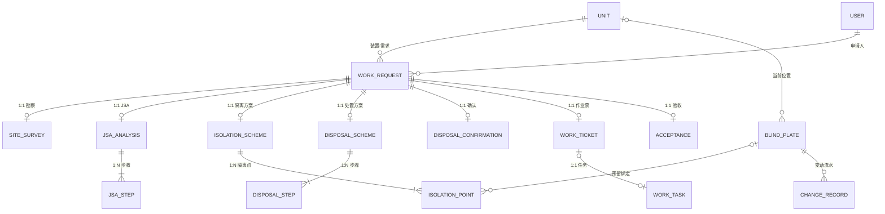

# 盲板管理系统 概要设计说明书

| 文档编号 | BP-HLD-002 |
| --- | --- |
| 文档名称 | 石化厂盲板管理系统 概要设计说明书 |
| 版本 | V1.0 |
| 编写 | 设计文档代理（Task 2-a） |
| 上游文档 | 01-功能需求说明书.md |
| 下游文档 | 03-详细设计.md |

---

## 1 引言

### 1.1 编写目的

本文档在需求说明书基础上，给出系统的总体架构、技术选型、功能模块划分、数据库概要设计、API 规范约定、状态机设计与权限模型，作为详细设计与编码实现的总体约束。

### 1.2 设计原则

1. **契约先行**：以 worklog.md 中既定的 API 契约与数据模型为唯一事实来源，概要/详细设计与之一致；
2. **状态驱动**：业务流程以 WorkRequest 状态机为核心，所有写接口都是"状态机事件"，禁止绕过状态校验；
3. **留痕完备**：审批类动作写 ApprovalRecord，盲板资产变化写 ChangeRecord，满足 HSE 可追溯要求；
4. **沙箱-生产同构**：沙箱实现（Next.js + SQLite）与生产形态（Node.js + MySQL + Vue3/uniapp）在 API、数据模型、状态机上完全同构，仅载体不同；
5. **前后端解耦**：API 全部位于 `/api/*`，前端统一经 `src/lib/bp-api.ts` 封装访问，值映射集中于 `src/lib/bp-types.ts`。

---

## 2 总体架构

### 2.1 逻辑架构（三层）

```text
┌─────────────────────────────────────────────────────────────────────────┐
│                           前端层 (Presentation)                          │
│  ┌───────────────────────────────┐   ┌────────────────────────────────┐ │
│  │  WEB 端 (管理端 SPA)           │   │  移动端 (uniapp + uview2)       │ │
│  │  · 登录门 / 侧边栏导航 / 顶栏   │   │  · 我的任务 / 扫码识别盲板       │ │
│  │  · 系统管理·基础数据·作业需求   │   │  · 任务执行反馈 / 验收申请       │ │
│  │  · 方案编制·作业任务·台账·统计  │   │  · 消息通知                    │ │
│  │  · 内置移动端模拟器(沙箱)       │   │  (生产编译 H5/小程序/App)        │ │
│  └───────────────┬───────────────┘   └───────────────┬────────────────┘ │
│                  │   bp-api.ts fetch 封装 (统一 /api/* 调用)             │
└──────────────────┼──────────────────────────────────────────────────────┘
                   ▼  HTTP JSON
┌─────────────────────────────────────────────────────────────────────────┐
│                           应用层 (Application)                           │
│  ┌────────────────────────────────────────────────────────────────────┐ │
│  │  API 路由层  /api/auth /api/users /api/units /api/dicts             │ │
│  │             /api/blind-plates /api/inventory /api/change-records    │ │
│  │             /api/work-requests(+submit/survey/jsa/cancel)           │ │
│  │             /api/isolation-schemes(+submit/review)                  │ │
│  │             /api/isolation-points/[id](reserve/execute)             │ │
│  │             /api/disposal-schemes(+submit/review)                   │ │
│  │             /api/disposal-confirmations /api/work-tickets(+issue/   │ │
│  │              review/start/finish/close) /api/work-tasks             │ │
│  │             /api/acceptances /api/stats/overview                    │ │
│  ├────────────────────────────────────────────────────────────────────┤ │
│  │  业务服务：编号生成 │ 状态机守卫 │ 盲板联动 │ 审批留痕 │ 库存聚合      │ │
│  └────────────────────────────────────────────────────────────────────┘ │
└──────────────────────────┬──────────────────────────────────────────────┘
                           ▼  Prisma Client
┌─────────────────────────────────────────────────────────────────────────┐
│                           数据层 (Persistence)                           │
│   SQLite(沙箱 db/custom.db)  ⇄  MySQL(生产)  —— 19 张表                  │
│   系统域: User Unit Dict                                                 │
│   台账域: BlindPlate InventoryItem ChangeRecord                          │
│   流程域: WorkRequest SiteSurvey JsaAnalysis JsaStep                     │
│           IsolationScheme IsolationPoint DisposalScheme DisposalStep     │
│           DisposalConfirmation WorkTicket WorkTask Acceptance            │
│   公共域: ApprovalRecord                                                 │
└─────────────────────────────────────────────────────────────────────────┘
```

### 2.2 沙箱部署形态

```text
浏览器 ──► Next.js 16 (App Router, 单页路由 / )
            ├── 静态资源: Tailwind CSS 4 + shadcn/ui 组件树 (src/components/bp/*)
            ├── API Routes: /api/* (Node runtime, src/app/api/**)
            └── Prisma Client ──► SQLite 文件库 db/custom.db
```

沙箱中"前端"与"应用层"同进程部署：页面首载后由 SPA 接管路由（无刷新切换模块），所有数据交互走 `/api/*` JSON 接口；移动端功能以"内置移动端模拟器"组件呈现（375px 视口内渲染移动端布局），与生产 uniapp 页面同接口。

### 2.3 生产部署形态

```text
┌ 管理端: Vue3 + Element Plus + ECharts (Nginx 静态托管)
├ 移动端: uniapp 编译 H5 / 微信小程序 / App (uview2 组件库)
├ 服务端: Node.js (NestJS/Express) REST API ──► MySQL 8 (主备, 每日备份)
└ 基础设施: 企业内网 DMZ + HTTPS 网关 + 对接企业微信/短信(消息通知扩展)
```

### 2.4 沙箱实现 ⇄ 生产形态映射关系

| 层次 | 沙箱实现（当前交付） | 生产形态 | 映射说明 |
| --- | --- | --- | --- |
| WEB 前端 | Next.js 16 App Router 单页应用（/ 路由 + 组件级模块切换），Tailwind CSS 4 + shadcn/ui + lucide-react + recharts | Vue3 + Element Plus + ECharts 独立前端工程 | 页面结构、接口调用、值映射、状态徽章逻辑一一对应；shadcn 组件替换为 Element Plus 同类组件 |
| 移动端 | WEB 内置移动端模拟器组件（375px 视口） | uniapp + uview2 编译 H5/小程序/App | 页面清单与接口一致，模拟器页面即 uniapp 页面原型 |
| API 层 | Next.js Route Handlers（src/app/api/**） | Node.js 后端框架（NestJS/Express Router） | 路径、方法、请求/响应契约完全相同，迁移仅是宿主框架变化 |
| ORM/数据库 | Prisma + SQLite（db/custom.db） | Prisma + MySQL（provider 改 mysql） | schema 字段类型兼容，仅调整 datasource 与连接串；`@db.Text` 等注解在 MySQL 下补齐 |
| 认证 | 登录接口返回用户对象，前端存 localStorage（bp_current_user） | JWT + 服务端会话校验 + 密码 bcrypt 哈希 | 沙箱省略 token，生产在 API 网关/中间件统一校验 |
| 消息通知 | 看板待办 + 审批时间线承载 | 企业微信/短信/邮件网关 | 通知触发点已内置在业务事件中，扩展无需改模型 |

---

## 3 技术选型说明

### 3.1 沙箱实现选型

| 类别 | 选型 | 理由 |
| --- | --- | --- |
| 全栈框架 | Next.js 16（App Router）+ TypeScript | 前后端同仓同进程，Route Handlers 快速实现 /api/*，单页路由满足"侧边栏模块导航"交互；TS 保证与 Prisma 模型类型贯通 |
| ORM/数据库 | Prisma + SQLite | 零配置文件库，schema 与 MySQL 兼容（provider 一键切换），适合沙箱快速落地与演示数据重置（prisma/seed.ts） |
| UI | Tailwind CSS 4 + shadcn/ui + lucide-react | 组件源码内联可控、表单/表格/抽屉/弹窗齐备，符合管理端密集表单场景 |
| 图表 | recharts | React 生态轻量图表，覆盖看板柱状/折线/饼图需求 |
| 状态管理 | useState/Context（必要时 zustand） | 登录用户存 localStorage 'bp_current_user'，全局态简单，无需重状态库 |

### 3.2 生产形态选型

| 类别 | 选型 | 理由 |
| --- | --- | --- |
| 后端 | Node.js（NestJS 或 Express） | 与沙箱 API 同语言同契约；模块化/装饰器便于权限中间件与事务封装 |
| 数据库 | MySQL 8 | 企业主流、支持主备与备份策略；InnoDB 事务保障编号生成与状态联动的原子性 |
| WEB 端 | Vue3 + Element Plus + ECharts + Pinia | 国内企业中后台事实标准，表格/表单组件成熟，与石化 IT 团队技能栈匹配 |
| 移动端 | uniapp + uview2 | 一套代码编译 H5/小程序/App，现场扫码（uni.scanCode）与推送生态成熟 |
| 认证 | JWT + bcrypt + RBAC 中间件 | 无状态横向扩展，角色校验收敛在服务端 |

### 3.3 关键技术约定

1. **API 契约不变量**：无论沙箱或生产，接口路径/方法/参数/响应结构以 03-详细设计 第 3 章为准，前端 `bp-api.ts` 对返回做统一解包；
2. **编号由服务端生成**：WR-/GL-/GY-/BP-/TSK-/MB- 编号一律服务端生成（见 03-详细设计 4.1），前端只读展示；
3. **状态校验在服务端**：所有推进/审核/执行接口先校验当前状态合法性，再执行写入（状态机守卫），防止并发重复推进；
4. **事务边界**：涉及多表联动的写操作（创建作业票=票+任务；隔离点执行=点+盲板+流水）放入同一事务。

---

## 4 功能模块划分

### 4.1 模块-子功能树

```text
盲板管理系统
├── M1 系统管理 (SM)
│   ├── M1.1 登录认证 (WEB-SM-01)
│   ├── M1.2 用户管理 (WEB-SM-02)
│   └── M1.3 审批留痕查询 (WEB-SM-03, 嵌入详情时间线)
├── M2 基础数据管理 (BD)
│   ├── M2.1 装置管理 (WEB-BD-01)
│   └── M2.2 数据字典 (WEB-BD-02)
├── M3 作业需求 (XJ)
│   ├── M3.1 作业需求登记 (WEB-XJ-01)
│   ├── M3.2 作业需求列表与查询 (WEB-XJ-02)
│   ├── M3.3 作业需求详情·全链路视图 (WEB-XJ-03)
│   ├── M3.4 需求编辑/提交/取消 (WEB-XJ-04)
│   ├── M3.5 现场勘察登记 (WEB-XJ-05)
│   └── M3.6 JSA 分析编制 (WEB-XJ-06)
├── M4 方案编制 (FA)
│   ├── M4.1 隔离方案编制·含盲板预留 (WEB-FA-01)
│   ├── M4.2 隔离方案提交与审核 (WEB-FA-02)
│   ├── M4.3 工艺处置方案编制 (WEB-FA-03)
│   ├── M4.4 处置方案提交与审核 (WEB-FA-04)
│   └── M4.5 工艺处置确认·气体检测 (WEB-FA-05)
├── M5 作业任务管理 (ZY)
│   ├── M5.1 开作业票 (WEB-ZY-01)
│   ├── M5.2 作业票签发与批准 (WEB-ZY-02)
│   ├── M5.3 作业执行管理 start/finish/close (WEB-ZY-03)
│   ├── M5.4 作业任务跟踪·隔离点执行 (WEB-ZY-04)
│   └── M5.5 作业验收 (WEB-ZY-05)
├── M6 台账管理 (TZ)
│   ├── M6.1 盲板台账·一板一码 (WEB-TZ-01)
│   ├── M6.2 盲板库存·低库存预警 (WEB-TZ-02)
│   └── M6.3 盲板变动记录 (WEB-TZ-03)
├── M7 统计分析 (TJ)
│   ├── M7.1 综合统计看板 (WEB-TJ-01)
│   └── M7.2 待办工作台 (WEB-TJ-02)
└── M8 移动端 (APP, uniapp+uview2)
    ├── M8.1 我的任务 (APP-RW-01)
    ├── M8.2 扫码识别盲板 (APP-SM-02)
    ├── M8.3 任务执行反馈 (APP-FK-03)
    ├── M8.4 验收申请 (APP-YS-04)
    └── M8.5 消息通知 (APP-XX-05)
```

### 4.2 模块依赖关系

```text
M2 基础数据 ──► M3 作业需求(装置/字典下拉)
M3 作业需求 ──► M4 方案编制(勘察/JSA 为方案输入)
M4 方案编制 ──► M5 作业任务管理(隔离点/处置步骤为票面与执行明细)
M6 台账管理 ◄──► M4/M5(预留/执行联动盲板状态与流水)
M1 系统管理 ──► 全模块(用户身份与角色)
M7 统计分析 ◄──── 全模块(只读聚合)
M8 移动端 ◄───── M5/M6(任务、隔离点、盲板、验收同接口)
```

---

## 5 数据库概要设计

### 5.1 数据表清单（19 张，4 个业务域）

> 说明：prisma/schema.prisma 实际包含 19 个模型（worklog 按"主单据+明细"口径记录为 18，其中 JsaStep、IsolationPoint、DisposalStep 为明细子表）。本文档以 schema 实际为准。

| 域 | 表名(Prisma Model) | 中文名 | 主键 | 说明 |
| --- | --- | --- | --- | --- |
| 系统域 | User | 用户 | id(String cuid) | 7 类角色账号 |
| 系统域 | Unit | 装置/车间 | id(Int 自增) | 基础组织数据 |
| 系统域 | Dict | 数据字典 | id(Int 自增) | 5 类枚举字典 |
| 台账域 | BlindPlate | 盲板实体 | id(Int 自增) | 一板一码 |
| 台账域 | InventoryItem | 盲板库存 | id(Int 自增) | 按规格+类型+材质聚合 |
| 台账域 | ChangeRecord | 盲板变动记录 | id(Int 自增) | 台账流水，只增不改 |
| 流程域 | WorkRequest | 作业需求(核心主单据) | id(Int 自增) | 状态机宿主 |
| 流程域 | SiteSurvey | 现场勘察记录 | id(Int 自增) | 一需求一条(unique) |
| 流程域 | JsaAnalysis | JSA 分析 | id(Int 自增) | 一需求一条(unique) |
| 流程域 | JsaStep | JSA 作业步骤 | id(Int 自增) | JsaAnalysis 1:N |
| 流程域 | IsolationScheme | 隔离方案 | id(Int 自增) | 一需求一条(unique)，GL- |
| 流程域 | IsolationPoint | 隔离点 | id(Int 自增) | IsolationScheme 1:N |
| 流程域 | DisposalScheme | 工艺处置方案 | id(Int 自增) | 一需求一条(unique)，GY- |
| 流程域 | DisposalStep | 工艺处置步骤 | id(Int 自增) | DisposalScheme 1:N |
| 流程域 | DisposalConfirmation | 工艺处置确认 | id(Int 自增) | 一需求一条(unique) |
| 流程域 | WorkTicket | 作业票 | id(Int 自增) | 一需求一条(unique)，BP- |
| 流程域 | WorkTask | 作业任务 | id(Int 自增) | 一需求一条(unique)，TSK- |
| 流程域 | Acceptance | 作业验收 | id(Int 自增) | 一需求一条(unique) |
| 公共域 | ApprovalRecord | 审批记录 | id(Int 自增) | 通用留痕(bizType+bizId) |

### 5.2 ER 关系文字描述

核心聚合根为 **WorkRequest（作业需求）**，全链路单据围绕它以"一需求一单"展开：

1. `Unit 1:N WorkRequest`（装置拥有多个作业需求；WorkRequest.unitId → Unit.id）
2. `User 1:N WorkRequest`（申请人；WorkRequest.applicantId → User.id，冗余 applicantName 展示）
3. `WorkRequest 1:1 SiteSurvey`（现场勘察，workRequestId 唯一）
4. `WorkRequest 1:1 JsaAnalysis 1:N JsaStep`（JSA 分析及其步骤，JsaStep.jsaId → JsaAnalysis.id，级联删除）
5. `WorkRequest 1:1 IsolationScheme 1:N IsolationPoint`（隔离方案及其隔离点，IsolationPoint.schemeId → IsolationScheme.id，级联删除）
6. `BlindPlate 1:N IsolationPoint`（一块盲板可先后被多个隔离点历史引用；IsolationPoint.blindPlateId 可空，表示未预留）
7. `WorkRequest 1:1 DisposalScheme 1:N DisposalStep`（工艺处置方案及其步骤，级联删除）
8. `WorkRequest 1:1 DisposalConfirmation`（处置确认单）
9. `WorkRequest 1:1 WorkTicket 1:1 WorkTask`（一需求一票一任务；WorkTask.ticketId → WorkTicket.id 可空）
10. `WorkRequest 1:1 Acceptance`（验收单）
11. `BlindPlate 1:N ChangeRecord`（盲板变动流水；blindPlateId 可空，blindCode 必填兜底）
12. `ApprovalRecord` 独立通用表：以 (bizType, bizId) 逻辑外键指向 IsolationScheme / DisposalScheme / WorkTicket，bizCode 冗余编号便于展示
13. `Unit 1:N BlindPlate`（盲板当前位置所属装置，unitId 可空——在库时为空）
14. `InventoryItem` 与 BlindPlate 无外键，为**派生聚合视图**：按 (spec,type,material) 统计 IN_STOCK 盲板数量（含虚拟库存行，用于预警管理）

### 5.3 ER 图（mermaid）



---

## 6 API 规范约定

### 6.1 路径与方法约定

1. 全部接口挂载 `/api/*`，资源名用 kebab-case 复数名词：`/api/work-requests`、`/api/isolation-schemes`；
2. 集合资源：`GET /api/xxx`（列表，query 筛选）、`POST /api/xxx`（新建）；
3. 单项资源：`GET/PUT/DELETE /api/xxx/[id]`；
4. 业务动作（状态机事件）用动词子路径：`POST /api/work-requests/[id]/submit`、`POST /api/isolation-schemes/[id]/review`、`POST /api/work-tickets/[id]/issue|review|start|finish|close`、`POST /api/isolation-points/[id]/reserve|execute`、`POST /api/inventory/[id]/adjust`、`POST /api/work-requests/[id]/cancel`；
5. 只读查询接口不做 POST；所有写接口为 POST/PUT/DELETE，请求体 JSON（`Content-Type: application/json`）。

### 6.2 统一返回结构

```jsonc
// 成功
{ "ok": true,  "data": { /* 业务数据：对象/数组/统计体 */ } }
// 失败
{ "ok": false, "message": "人类可读的错误说明", "code": 400 }
```

- 前端统一经 `src/lib/bp-api.ts` 封装：`request(path, options)` 自动解包 `data`，失败抛出/弹出 `message`；
- 列表接口 `data` 为数组；详情接口 `data` 为聚合对象；统计接口 `data` 为固定键名的统计体。

### 6.3 错误码与错误语义

| code | 语义 | 典型场景 |
| --- | --- | --- |
| 400 | 参数/状态非法 | 状态机前置校验不通过（如非 CONFIRMED 开票）、必填缺失 |
| 401 | 未登录/认证失败 | 用户名或密码错误、会话失效 |
| 403 | 无权限 | 角色不满足接口要求 |
| 404 | 资源不存在 | id 无效 |
| 409 | 冲突 | 唯一编号重复（用户名/装置编码/盲板编号）、重复开票 |
| 500 | 服务器内部错误 | 兜底，返回通用信息不泄露堆栈 |

### 6.4 编号规则（服务端生成）

| 单据 | 前缀 | 格式 | 示例 |
| --- | --- | --- | --- |
| 作业需求 | WR- | WR-YYYYMM-NNN（按月 3 位流水） | WR-202506-001 |
| 隔离方案 | GL- | GL-YYYYMM-NNN | GL-202506-001 |
| 工艺处置方案 | GY- | GY-YYYYMM-NNN | GY-202506-001 |
| 作业票 | BP- | BP-YYYYMM-NNN | BP-202506-001 |
| 作业任务 | TSK- | TSK-YYYYMM-NNN | TSK-202506-001 |
| 盲板 | MB- | MB-规格-NNNN（全局 4 位流水） | MB-DN150-0001 |

详细生成算法与并发控制见 03-详细设计 4.1。

### 6.5 通用数据约定

1. 时间字段 ISO 8601 字符串（如 `2025-06-01T08:30:00.000Z`），前端本地化展示；
2. 金额/数量为整数（quantity、delta），厚度为浮点（thickness mm）；
3. 枚举值全部大写下划线（如 ISOLATION_PENDING_REVIEW），中文映射集中于 `bp-types.ts`（STATUS_MAP/ROLE_MAP/WORK_TYPE_MAP 等），前端徽章颜色统一由此导出；
4. 名称为文本联动冗余：WorkRequest.applicantName、WorkTask.assignee、ChangeRecord.operator 等直接存姓名字符串，避免强依赖用户表（人员可能是外协）。

---

## 7 状态机设计

### 7.1 WorkRequest 主状态机（20 状态，完整枚举）

与 worklog.md 定义严格一致：

```text
DRAFT(草稿)
→ PENDING_SURVEY(待现场勘察)          # submit
→ SURVEYED(已勘察待JSA)               # survey
→ JSA_DONE(JSA完成待方案)             # jsa
→ ISOLATION_PREPARING(隔离方案编制中)  # 创建隔离方案 GL-
→ ISOLATION_PENDING_REVIEW(待审核)    # 方案 submit
→ ISOLATION_APPROVED(已审核)          # review approve   [驳回→ISOLATION_REJECTED 可回退重审]
→ DISPOSAL_PREPARING(处置方案编制中)   # 创建处置方案 GY-
→ DISPOSAL_PENDING_REVIEW(待审核)     # 方案 submit
→ DISPOSAL_APPROVED(已审核)           # review approve   [驳回→DISPOSAL_REJECTED 可回退重审]
→ PENDING_CONFIRM(待工艺处置确认)      # 发起处置确认
→ CONFIRMED(处置已确认待开票)          # result=QUALIFIED
→ TICKET_ISSUED(作业票待批准)          # 票 issue
→ TICKET_APPROVED(已批准待作业)        # 票 review approve
→ IN_PROGRESS(作业中)                 # 票 start
→ PENDING_ACCEPTANCE(待验收)          # 票 finish
→ COMPLETED(已完成)                   # 验收 PASS / 票 close
CANCELLED(已取消)                      # 任意前置态 cancel 可达（COMPLETED 除外）
```

驳回回退分支：

```text
ISOLATION_PENDING_REVIEW --驳回--> ISOLATION_REJECTED --修改重提--> ISOLATION_PENDING_REVIEW
DISPOSAL_PENDING_REVIEW  --驳回--> DISPOSAL_REJECTED  --修改重提--> DISPOSAL_PENDING_REVIEW
TICKET_ISSUED(票) --驳回(票VOID)--> 需求回退 CONFIRMED --重新开票--> TICKET_ISSUED
```

### 7.2 状态迁移与 API 对照表

| # | 迁移 | 触发 API | 备注 |
| --- | --- | --- | --- |
| 1 | DRAFT→PENDING_SURVEY | POST /api/work-requests/[id]/submit | — |
| 2 | PENDING_SURVEY→SURVEYED | POST /api/work-requests/[id]/survey | upsert 勘察 |
| 3 | SURVEYED→JSA_DONE | POST /api/work-requests/[id]/jsa | upsert JSA+steps |
| 4 | JSA_DONE→ISOLATION_PREPARING | POST /api/isolation-schemes?workRequestId= | 生成 GL- 编号 |
| 5 | ISOLATION_PREPARING→ISOLATION_PENDING_REVIEW | POST /api/isolation-schemes/[id]/submit | 写 SUBMIT 留痕 |
| 6 | ISOLATION_PENDING_REVIEW→ISOLATION_APPROVED | POST /api/isolation-schemes/[id]/review {approve:true} | 方案 APPROVED |
| 7 | ISOLATION_PENDING_REVIEW→ISOLATION_REJECTED | 同上 {approve:false} | 方案 REJECTED |
| 8 | ISOLATION_REJECTED→ISOLATION_PENDING_REVIEW | POST /api/isolation-schemes/[id]/submit | 修改后重提 |
| 9 | ISOLATION_APPROVED→DISPOSAL_PREPARING | POST /api/disposal-schemes?workRequestId= | 生成 GY- 编号 |
| 10 | DISPOSAL_PREPARING→DISPOSAL_PENDING_REVIEW | POST /api/disposal-schemes/[id]/submit | 留痕 |
| 11 | DISPOSAL_PENDING_REVIEW→DISPOSAL_APPROVED | POST /api/disposal-schemes/[id]/review {approve:true} | 方案 APPROVED |
| 12 | DISPOSAL_PENDING_REVIEW→DISPOSAL_REJECTED | 同上 {approve:false} | 方案 REJECTED |
| 13 | DISPOSAL_REJECTED→DISPOSAL_PENDING_REVIEW | POST /api/disposal-schemes/[id]/submit | 修改后重提 |
| 14 | DISPOSAL_APPROVED→PENDING_CONFIRM | POST /api/disposal-confirmations（进入确认） | — |
| 15 | PENDING_CONFIRM→CONFIRMED | POST /api/disposal-confirmations result=QUALIFIED | 不合格保持 PENDING_CONFIRM |
| 16 | CONFIRMED→(票 DRAFT) | POST /api/work-tickets?workRequestId= | 校验状态=CONFIRMED；生成 BP-+TSK- |
| 17 | CONFIRMED→TICKET_ISSUED | POST /api/work-tickets/[id]/issue | 票 DRAFT→PENDING_REVIEW |
| 18 | TICKET_ISSUED→TICKET_APPROVED | POST /api/work-tickets/[id]/review {approve:true} | 票 APPROVED |
| 19 | TICKET_ISSUED→CONFIRMED（回退） | 同上 {approve:false} | 票 VOID，可重新开票 |
| 20 | TICKET_APPROVED→IN_PROGRESS | POST /api/work-tickets/[id]/start | 任务 IN_PROGRESS+actualStart |
| 21 | IN_PROGRESS→PENDING_ACCEPTANCE | POST /api/work-tickets/[id]/finish | 任务 DONE |
| 22 | PENDING_ACCEPTANCE→COMPLETED | POST /api/acceptances（PASS） | 写验收单 |
| 23 | PENDING_ACCEPTANCE→COMPLETED | POST /api/work-tickets/[id]/close | 票 CLOSED（归档路径） |
| 24 | 任意前置→CANCELLED | POST /api/work-requests/[id]/cancel | COMPLETED/CANCELLED 除外 |

### 7.3 子单据状态机

| 单据 | 状态集 | 主线 | 驳回/异常 |
| --- | --- | --- | --- |
| IsolationScheme | DRAFT/PENDING_REVIEW/APPROVED/REJECTED | DRAFT→PENDING_REVIEW→APPROVED | REJECTED→(修改)→PENDING_REVIEW |
| DisposalScheme | 同上 | 同上 | 同上 |
| WorkTicket | DRAFT/PENDING_REVIEW/APPROVED/IN_PROGRESS/FINISHED/CLOSED/VOID | DRAFT→PENDING_REVIEW→APPROVED→IN_PROGRESS→FINISHED→CLOSED | PENDING_REVIEW 驳回→VOID |
| WorkTask | PENDING/IN_PROGRESS/DONE | 随票 start/finish 联动 | — |
| BlindPlate | IN_STOCK/RESERVED/INSTALLED/SCRAPPED | IN_STOCK→RESERVED→INSTALLED→IN_STOCK | INSTALLED/IN_STOCK→SCRAPPED；每次变化写 ChangeRecord |
| IsolationPoint.done | false→true | execute 写 operator/doneAt | — |

---

## 8 权限模型

### 8.1 角色-模块矩阵

●=可操作（写），○=只读，—=不可见

| 模块 \ 角色 | ADMIN | MANAGER | ENGINEER | REVIEWER | OPERATOR | GUARDIAN | ACCEPTOR |
| --- | --- | --- | --- | --- | --- | --- | --- |
| M1 系统管理/用户管理 | ● | — | — | — | — | — | — |
| M1 登录（本人信息） | ● | ● | ● | ● | ● | ● | ● |
| M2 装置管理 | ● | ○ | ○ | ○ | ○ | ○ | ○ |
| M2 数据字典 | ● | ○ | ○ | ○ | ○ | ○ | ○ |
| M3 作业需求登记/提交 | ○ | ● | ● | — | — | — | — |
| M3 需求列表/详情 | ○ | ○ | ○ | ○ | ○ | ○ | ○ |
| M3 现场勘察登记 | — | ○ | ● | — | — | ○ | — |
| M3 JSA 编制 | — | ○ | ● | ○ | ○ | ○ | — |
| M4 隔离方案编制/提交 | — | ○ | ● | — | — | — | — |
| M4 方案审核（隔离/处置） | — | ○ | ○ | ● | — | — | — |
| M4 处置方案编制/提交 | — | ○ | ● | — | — | — | — |
| M4 处置步骤执行勾选 | — | ○ | ● | — | — | — | — |
| M4 处置确认登记 | — | ○ | ● | — | — | — | — |
| M5 开作业票/签发 | — | ● | ○ | — | — | — | — |
| M5 作业票批准 | — | ○ | — | ● | — | — | — |
| M5 作业开始/完工 | — | ● | ○ | — | ● | — | — |
| M5 作业票关闭 | ● | ● | — | — | — | — | — |
| M5 隔离点预留/执行 | — | — | ○ | — | ● | — | — |
| M5 作业验收登记 | — | ○ | ○ | — | — | — | ● |
| M6 盲板台账维护 | ● | ○ | ○ | — | ○ | — | — |
| M6 库存调整 | ● | ○ | — | — | — | — | — |
| M6 变动记录查询 | ○ | ○ | ○ | ○ | ○ | ○ | ○ |
| M7 统计看板 | ○ | ○ | ○ | ○ | ○ | ○ | ○ |
| M8 移动端·我的任务/执行 | — | — | ○ | — | ● | ○ | — |
| M8 移动端·扫码盲板 | — | — | — | — | ● | — | — |
| M8 移动端·验收申请/登记 | — | — | — | — | ● | — | ● |

### 8.2 接口级权限约定（生产形态服务端强制）

| 接口组 | 允许角色 |
| --- | --- |
| POST/PUT/DELETE /api/users、/api/units、/api/dicts 维护 | ADMIN |
| POST /api/work-requests、PUT /api/work-requests/[id] | MANAGER、ENGINEER |
| /submit、/cancel | MANAGER、ENGINEER（申请人） |
| /survey、/jsa | ENGINEER |
| /api/isolation-schemes、/api/disposal-schemes 写操作及 /submit | ENGINEER |
| /review（方案） | REVIEWER |
| /api/disposal-confirmations | ENGINEER |
| POST /api/work-tickets、/issue | MANAGER |
| /api/work-tickets/[id]/review | REVIEWER |
| /start、/finish | MANAGER、OPERATOR |
| /close | MANAGER、ADMIN |
| /api/isolation-points/[id]/reserve、/execute | OPERATOR |
| /api/acceptances | ACCEPTOR |
| /api/inventory/[id]/adjust、/api/blind-plates 写 | ADMIN |
| 全部 GET 列表/详情/统计 | 登录用户 |

> 沙箱实现：以前端角色显隐（导航/按钮级 RBAC）为主；生产实现：上表在服务端中间件强制校验，前端显隐仅为体验优化。

### 8.3 敏感操作约束

1. 删除装置/用户/盲板：仅 ADMIN，且有关联业务数据时阻止物理删除（提示改用停用/报废）；
2. 已进入流程（非 DRAFT）的需求禁止编辑基本信息；
3. 方案 APPROVED 后禁止编辑隔离点/处置步骤（须走驳回重提路径）；
4. 隔离点 done=true 后禁止重复执行（幂等返回）；
5. 一需求仅一票一任务，重复生成返回 409。

---

## 9 关键设计决策记录

| 编号 | 决策 | 理由 |
| --- | --- | --- |
| D1 | 以 WorkRequest 单表状态机（20 状态）承载全流程，而非每环节独立单据表 | 需求-勘察-JSA-方案-票-任务-验收均为"一需求一单"，聚合查询简单，状态即流程 |
| D2 | 勘察/JSA/方案/确认/票/任务/验收全部 workRequestId @unique（1:1） | 保证一需求一票一任务；重复提交语义为 upsert 覆盖 |
| D3 | 审批留痕独立通用表 ApprovalRecord（bizType+bizId） | 隔离方案/处置方案/作业票三处审批共用，避免三表重复设计 |
| D4 | 盲板台账与库存分离：BlindPlate（实体一板一码）+ InventoryItem（聚合+预警线） | 台账管"每一块"，库存管"每一类"；库存支持虚拟行用于采购预警 |
| D5 | 盲板状态联动全部写 ChangeRecord，且 fromStatus/toStatus 记录前后值 | 满足 HSE"可追溯"审计要求，流水不可篡改 |
| D6 | 单页应用 + 组件级模块路由（非多路由页） | 沙箱交付形态约束；生产 Vue 端可用 vue-router 同构映射 |
| D7 | 编号服务端按"前缀-年月-流水"生成 | 与种子数据格式一致（WR-202506-001），月度重置便于人工对账 |
| D8 | 作业票驳回=票 VOID+需求回退 CONFIRMED | 与"一张票对应一个作业需求"约束自洽，票号不复用 |

（本文档完）
